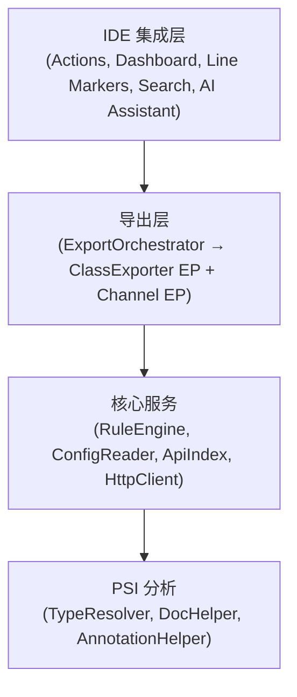

# EasyYapi

[](https://github.com/tangcent/easy-yapi/actions/workflows/ci.yml)
[](https://codecov.io/gh/tangcent/easy-yapi)
[](https://plugins.jetbrains.com/plugin/12458-easyyapi)
[](https://plugins.jetbrains.com/plugin/12458-easyyapi)
[](https://deepwiki.com/tangcent/easy-yapi)

[English](README.md) | 中文

> **注意：** 这是 EasyYapi 的 v3.0 重写版本。如需获取稳定版 v2.x 的源代码，请访问
> [`stable/v2.x.x`](https://github.com/tangcent/easy-yapi/tree/stable/v2.x.x) 分支。

一个用于 API 开发的 IntelliJ IDEA 插件 —— 将 API 文档导出至 YApi/Postman/Markdown，发送请求，直接在代码中管理接口。

## 功能特性

### API 导出

将源代码中的 API 接口导出为多种格式：

| 格式 | HTTP | gRPC | 输出 |
|------|------|------|------|
| [YApi](https://easyyapi.github.io/guide/export2yapi) | ✓ | — | 上传至 YApi 平台，支持分类管理、Mock 规则和更新确认 |
| [Postman](https://easyyapi.github.io/guide/export2postman) | ✓ | — | JSON 文件或直接上传至 Postman 工作区 |
| [Markdown](https://easyyapi.github.io/guide/export2markdown) | ✓ | ✓ | .md 文档文件 |
| cURL | ✓ | ✓ | 可执行的 Shell 命令 |
| HTTP Client | ✓ | ✓ | IntelliJ HTTP Client 临时文件 |

### API 仪表盘

内置工具窗口，提供项目中所有 API 接口的树形视图：

- 按模块和类浏览接口
- 按路径、名称或 HTTP 方法搜索和过滤接口
- 查看接口详情（参数、请求头、请求体、响应）
- 直接从仪表盘发送 HTTP 请求
- 单击导航至源代码
- 自动持久化编辑的请求参数

### 发送 API 请求

直接从编辑器调用任意 API 接口：

- 右键点击控制器方法 → **Call**（或按 `Ctrl+C` (macOS) / `Alt+Shift+C`）
- API 仪表盘将打开并导航至所选接口
- 发送前编辑参数、请求头和请求体
- 查看带语法高亮的响应

### API 全局搜索

使用 IntelliJ 的 Search Everywhere（双击 Shift）从 IDE 任意位置查找 API 接口：

- 按 HTTP 方法前缀搜索（如 `GET /users`）
- 按路径、接口名称、类名或描述搜索
- 点击搜索结果直接导航至源方法

### 行标记图标

API 方法在编辑器中会显示行标记图标，点击即可在 API 仪表盘中打开该接口。

### 字段转换

将类字段转换为多种格式：

- **To JSON** — 带默认值的标准 JSON
- **To JSON5** — 支持注释的 JSON5 格式
- **To Properties** — Java `.properties` 格式

### 支持的框架

| 类别 | 支持 |
|------|------|
| 语言 | Java、Kotlin、Scala（可选）、Groovy（可选） |
| Web 框架 | Spring MVC、Spring Cloud OpenFeign、JAX-RS（Quarkus / Jersey） |
| RPC | gRPC |
| 校验 | javax.validation / Jakarta Validation |
| 序列化 | Jackson、Gson |
| API 文档 | Swagger 2 / OpenAPI 3 注解 |
| Spring Actuator | Actuator 端点 |

#### Spring MVC

完整支持 Spring MVC 注解：

- `@RequestMapping`、`@GetMapping`、`@PostMapping`、`@PutMapping`、`@DeleteMapping`、`@PatchMapping`
- `@RequestParam`、`@PathVariable`、`@RequestBody`、`@RequestHeader`、`@CookieValue`
- `@RestController`、`@Controller`
- 类级别和方法级别的映射组合
- 参数化控制器的泛型类型解析
- 自定义元注解支持

#### Spring Cloud OpenFeign

支持 Feign 客户端接口：

- `@FeignClient` 接口检测
- 接口方法上的 Spring MVC 注解
- 原生 Feign 注解：`@RequestLine`、`@Headers`、`@Body`、`@Param`

#### JAX-RS

完整支持 JAX-RS 注解：

- `@Path`、`@GET`、`@POST`、`@PUT`、`@DELETE`、`@PATCH`、`@HEAD`、`@OPTIONS`
- `@PathParam`、`@QueryParam`、`@FormParam`、`@HeaderParam`、`@CookieParam`、`@MatrixParam`
- `@Consumes`、`@Produces`

#### gRPC

支持 gRPC 服务实现：

- 服务路径提取（`/<package>.<ServiceName>/<MethodName>`）
- 流类型检测（一元、服务端流、客户端流、双向流）
- 请求/响应 protobuf 消息类型解析
- 服务器反射支持
- Stub 类解析

## 使用方法

### 导出 API

1. 在编辑器或项目视图中右键点击控制器文件、类或方法
2. 选择 **EasyApi → Export**（或按 `Ctrl+E` (macOS) / `Alt+Shift+E`）
3. 选择目标格式（YApi / Postman / Markdown / cURL / HTTP Client）
4. API 将自动导出

### 调用 API

1. 右键点击控制器方法
2. 选择 **EasyApi → Call**（或按 `Ctrl+C` (macOS) / `Alt+Shift+C`）
3. API 仪表盘将打开并加载该接口
4. 编辑参数并发送请求

### 打开 API 仪表盘

- 前往 **Tools → Open API Dashboard**
- 或点击 IDE 底部的 **API Dashboard** 标签页

### 搜索 API

1. 按 **双击 Shift** 打开 Search Everywhere
2. 切换到 **APIs** 标签页
3. 输入 HTTP 方法前缀（如 `GET /users`）或任意关键词

### 转换字段

1. 在编辑器中右键点击类
2. 选择 **EasyApi → ToJson / ToJson5 / ToProperties**

## 配置

EasyYapi 使用分层配置系统，多个配置源按优先级顺序处理：

| 优先级 | 来源 | 说明 |
|--------|------|------|
| 最高 | Runtime | 执行期间设置的编程覆盖 |
| | 项目规则 | `<project>/.easyapi/*.rules`（3.0 文件夹模型） |
| | 全局规则 | `~/.easyapi/*.rules`（应用于本机所有项目） |
| | 旧版项目文件 | 项目根目录（及祖先目录）下的 `.easy.api.config*` |
| | 扩展 | 插件扩展配置（Swagger、校验等） |
| | 远程 | 从 URL 获取的配置文件 |
| 最低 | 内置 | 默认捆绑配置 |

配置支持：

- **属性解析** — 使用 `${key}` 引用其他配置值
- **指令** — 控制解析行为（`#resolve`、`#ignore` 等）
- **规则引擎** — Groovy 脚本、正则表达式、注解表达式、标签表达式
- **远程配置** — 从 URL 加载共享配置（如 Swagger、javax.validation 预设）

### 什么时候需要自定义规则？

EasyApi 开箱即用即可理解标准 HTTP 框架（Spring MVC、WebFlux、JAX-RS、Feign）——**绝大多数项目无需自定义规则**。当存在扫描器无法感知的自定义框架行为时（例如某个 `jakarta.servlet.Filter` 要求一个请求头，或某个 `ResponseBodyAdvice` 将每个响应包装成统一信封），可使用内置 AI 助手或外部 skill 来检测并生成对应规则。完整自定义模式目录见[规则编写指南](src/main/resources/docs/knowledge-base/rule-guide.md)。

## Skills

EasyYapi 提供了一个外部 skill，让你喜欢的 AI 编程助手（Trae、Cursor、Cline、Continue 等）使用与内置助手相同的知识库来编写 EasyApi 规则文件。

### 安装 skill

```bash
npx skills add tangcent/easy-yapi -g -y
```

该命令会全局安装 [`easy-yapi-assistant`](skills/easy-yapi-assistant/SKILL.md) skill。安装后，当你要求添加或修改 EasyApi 规则时，AI 助手会自动调用它。

### 两种 AI 辅助编写规则的方式

| 方式 | 运行位置 | 适用场景 |
|------|----------|----------|
| **内置 Rules 标签页 Chat / Magic** | IntelliJ 内（Settings → EasyApi → Rules → Chat / Magic） | 希望一切在 IntelliJ 内完成；agent 可调用 PSI 工具检查项目。 |
| **外部 skill** | 任何具备文件访问能力的 AI 编程助手 | 已投入外部 AI 工作流的用户；助手使用自身的文件/PSI 访问能力。 |

内置助手从插件内读取 [`docs/knowledge-base/rule-guide.md`](src/main/resources/docs/knowledge-base/rule-guide.md)，而外部 skill 捆绑了它自己的副本（`skills/easy-yapi-assistant/rule-guide.md`）——仓库文件在 `npx skills add` 后并不可用，因为该命令只发布 `skills/easy-yapi-assistant/` 目录。两份副本保持同步，因此两种方式生成的规则内容保持一致。

## 开发

### 环境要求

- JDK 17 或更高版本
- IntelliJ IDEA 2025.2 或更高版本

### 构建与运行

```bash
# 运行安装了 EasyYapi 的 IDEA 实例
./gradlew runIde

# 运行所有测试
./gradlew clean test

# 生成 JaCoCo 覆盖率报告
./gradlew jacocoTestReport
```

### 兼容性

| JDK | IDE | 状态 |
|-----|-----|------|
| 17 | 2025.2.1 | ✓ |

## 架构

插件采用分层、扩展点驱动的架构：



- **ExportOrchestrator** — 协调完整的导出流水线：通过 `ApiScanner` 扫描接口，然后交给选定的 `Channel` 进行输出
- **ClassExporter** *(扩展点)* — 从 PSI 类中提取 `ApiEndpoint` 模型；内置实现：Spring MVC、Spring Cloud OpenFeign、JAX-RS、Spring Actuator、gRPC
- **Channel** *(扩展点)* — 将 `ApiEndpoint` 模型转换为输出格式并处理文件写入 / 远程上传；内置通道：YApi、Postman、Markdown、cURL、HTTP Client、Hoppscotch *(Beta)*。添加新的输出目标只需实现 `Channel` ——无需修改核心代码
- **ApiIndex** — 缓存已发现的接口，用于快速搜索和仪表盘访问
- **RuleEngine** — 评估规则表达式（Groovy、正则、注解、标签）以自定义解析行为
- **AI Assistant** — 可选的内置 agent，通过 PSI 工具检查项目并编写规则文件；外部 skill 等价物见 [Skills](#skills) 章节

### 项目结构

插件的源码树在 `src/main/kotlin/com/itangcent/easyapi/` 下组织为四个顶层桶：

```
com.itangcent.easyapi/
├── channel/      # 输出 —— 导出目标（YApi、Postman、Markdown、cURL、Hoppscotch、HTTP Client）
│   ├── spi/      #   Channel EP 契约：Channel、ChannelConfig、ChannelRegistry、…
│   ├── curl/
│   ├── hoppscotch/  (+ model/)
│   ├── httpclient/
│   ├── markdown/    (+ template/)
│   ├── postman/     (+ model/)
│   └── yapi/        (+ markdown/)  # 仅 easy-yapi
│
├── format/       # 字段/对象序列化（JSON、JSON5、YAML、Properties）
│   ├── spi/      #   FieldFormatChannel EP + FieldFormatExtensions（toJson/toJson5/toYaml/toProperties）
│   ├── json/
│   ├── json5/
│   ├── yaml/
│   └── properties/
│
├── framework/    # 输入 —— 源框架导出器（Spring MVC、JAX-RS、Feign、gRPC）
│   ├── springmvc/   # Spring MVC + Actuator
│   ├── jaxrs/
│   ├── feign/
│   └── grpc/        # 仅 class exporter —— 运行时管道位于 core/grpc
│
└── core/         # 共享基础设施（伞形包）
    ├── internal/    # 迁移后的窄 core/（EasyApiApplicationService、EasyApiProjectService、event/、threading/）
    ├── export/      # 中性流水线：ClassExporter、ClassExporterRegistry、EndpointBuilder、ExportOrchestrator、ExportContext、…  (+ recognizer/)
    ├── psi/         # (+ adapter/ doc/ helper/ model/ type/) —— ObjectModel 位于此处；format/ 消费它
    ├── config/      # (+ model/ parser/ resource/ source/)
    ├── rule/        # (+ context/ engine/ parser/)
    ├── http/        # HttpClientProvider + Apache/IntelliJ/UrlConnection 实现
    ├── logging/     # IdeaConsole、IdeaLog、IdeaConsoleProvider
    ├── ide/         # (+ action/ dialog/ linemarker/ script/ search/ support/) —— 无 fieldformat/（已移至 format/）
    ├── dashboard/   # API 仪表盘工具窗口
    ├── script/      # (+ env/ pm/) —— 脚本执行支持
    ├── util/        # (+ file/ ide/ json/ storage/ text/) —— FormatterHelper 留在此处（决策 F1）
    ├── cache/       # (+ api/ http/ json/)
    ├── settings/    # (+ migration/ module/ state/ ui/)
    ├── ai/          # (+ agent/ credentials/ tools/ ui/)
    ├── grpc/        # 运行时管道（描述符反射、proto）—— framework/grpc 消费者的对等物
    ├── repository/
    └── extension/
```

四个桶构成有向无环依赖图：`channel` 可以导入 `format`、`framework` 和 `core`；`format` 和 `framework` 可以导入 `core`；`core` 只从兄弟包导入扩展点契约接缝（`channel.spi.*`、`format.spi.*`、`core.export.*`）—— 禁止从 `core.*` 导入具体的 per-id 实现（`channel.<id>.*`、`format.<id>.*`、`framework.<id>.*`）。原始的窄 `core/` 包（服务、事件、线程）被重命名为 `core/internal/`，以便 `core/` 可以作为所有共享基础设施的伞形包。

### 如何添加新支持

插件围绕三个 IntelliJ 扩展点（EP）构建。添加对新输出目标、字段格式或源框架的支持，只需一个包操作加一行 `plugin.xml`。每个 EP 的**分步指南** —— SPI 参考、可选的 config/settings/rule-keys、示例、导入规则和测试 —— 见 [`docs/developer/`](docs/developer/README.md)。

#### 添加新 channel（输出目标）

channel 将 `ApiEndpoint` 模型转换为特定输出格式并处理文件写入或远程上传（例如 Postman 变体，或 Insomnia 等新目标）。创建一个 `channel/<id>/` 包，包含 `Channel` 实现，并注册到 `channel` EP：

```xml
<channel implementation="com.itangcent.easyapi.channel.<id>.<ChannelClass>" />
```

→ 完整指南：[docs/developer/channels.md](docs/developer/channels.md)（SPI 接口、选项面板、设置标签页、rule keys、`handleResult`、示例、导入规则）。

#### 添加新 format（字段序列化）

format 将 `ObjectModel` 序列化为特定表示（例如 TOML、XML）。创建一个 `format/<id>/` 包，包含一个纯渲染器加上 `FieldFormatChannel` 实现，并注册到 `fieldFormatChannel` EP：

```xml
<fieldFormatChannel implementation="com.itangcent.easyapi.format.<id>.<FieldFormatChannelClass>" />
```

→ 完整指南：[docs/developer/formats.md](docs/developer/formats.md)（两层架构、`ObjectModel` 输入、循环安全、入口扩展、示例、导入规则）。

#### 添加新 framework recognizer（源框架）

framework 扫描 PSI 中以特定框架注解声明的接口（例如 Micronaut）。创建一个 `framework/<id>/` 包，包含 `ClassExporter` 和 `ApiClassRecognizer`，并注册到**两个** EP（recognizer 驱动行标记、索引扫描、AI 发现和启用 —— 仅注册 exporter 会静默破坏它们）：

```xml
<classExporter implementation="com.itangcent.easyapi.framework.<id>.<ClassExporterClass>" />
<apiClassRecognizer implementation="com.itangcent.easyapi.framework.<id>.<RecognizerClass>" />
```

→ 完整指南：[docs/developer/frameworks.md](docs/developer/frameworks.md)（双 EP 概述、两个 SPI、4 步指南、rule 生命周期钩子、`ApiEndpoint` 结构、示例、导入规则）。

## 文档

- [指南](https://easyyapi.github.io/guide/) — 概述与功能特性
- [安装](https://easyyapi.github.io/guide/installation) — 从 Marketplace 或磁盘安装
- [使用](https://easyyapi.github.io/guide/use) — 导出和调用 API
- [导出至 YApi](https://easyyapi.github.io/guide/export2yapi) — YApi 导出与设置
- [导出至 Postman](https://easyyapi.github.io/guide/export2postman) — Postman 导出
- [导出至 Markdown](https://easyyapi.github.io/guide/export2markdown) — Markdown 导出与模板
- [调用 API](https://easyyapi.github.io/guide/call) — 发送请求、API 仪表盘、gRPC 调用
