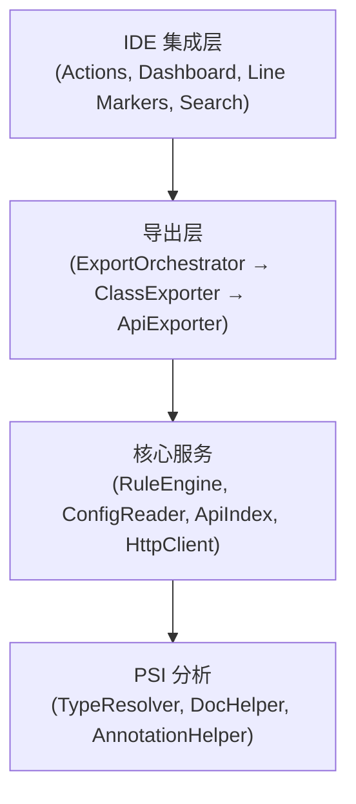

# EasyYapi

[](https://github.com/tangcent/easy-yapi/actions/workflows/ci.yml)
[](https://codecov.io/gh/tangcent/easy-yapi)
[](https://plugins.jetbrains.com/plugin/12458-easyyapi)
[](https://plugins.jetbrains.com/plugin/12458-easyyapi)

[English](README.md) | 中文

> **注意：** 这是 EasyYapi 的 v3.0 重写版本。如需获取稳定版 v2.x 的源代码，请访问
> [`stable/v2.x.x`](https://github.com/tangcent/easy-yapi/tree/stable/v2.x.x) 分支。

一个用于 API 开发的 IntelliJ IDEA 插件 —— 将 API 文档导出至 YApi/Postman/Markdown，发送请求，直接在代码中管理接口。

## 功能特性

### API 导出

将源代码中的 API 接口导出为多种格式：

| 格式 | HTTP | gRPC | 输出 |
|------|------|------|------|
| [YApi](https://easyyapi.github.io/guide/export2yapi) | ✓ | — | 上传至 YApi 平台，支持分类管理、Mock 规则和更新确认 |
| [Postman](https://easyyapi.github.io/guide/export2postman) | ✓ | — | JSON 文件或直接上传至 Postman 工作区 |
| [Markdown](https://easyyapi.github.io/guide/export2markdown) | ✓ | ✓ | .md 文档文件 |
| cURL | ✓ | ✓ | 可执行的 Shell 命令 |
| HTTP Client | ✓ | ✓ | IntelliJ HTTP Client 临时文件 |

### API 仪表盘

内置工具窗口，提供项目中所有 API 接口的树形视图：

- 按模块和类浏览接口
- 按路径、名称或 HTTP 方法搜索和过滤接口
- 查看接口详情（参数、请求头、请求体、响应）
- 直接从仪表盘发送 HTTP 请求
- 单击导航至源代码
- 自动持久化编辑的请求参数

### 发送 API 请求

直接从编辑器调用任意 API 接口：

- 右键点击控制器方法 → **Call**（或按 `Ctrl+C` (macOS) / `Alt+Shift+C`）
- API 仪表盘将打开并导航至所选接口
- 发送前编辑参数、请求头和请求体
- 查看带语法高亮的响应

### API 全局搜索

使用 IntelliJ 的 Search Everywhere（双击 Shift）从 IDE 任意位置查找 API 接口：

- 按 HTTP 方法前缀搜索（如 `GET /users`）
- 按路径、接口名称、类名或描述搜索
- 点击搜索结果直接导航至源方法

### 行标记图标

API 方法在编辑器中会显示行标记图标，点击即可在 API 仪表盘中打开该接口。

### 字段转换

将类字段转换为多种格式：

- **To JSON** — 带默认值的标准 JSON
- **To JSON5** — 支持注释的 JSON5 格式
- **To Properties** — Java `.properties` 格式

### 支持的框架

| 类别 | 支持 |
|------|------|
| 语言 | Java、Kotlin、Scala（可选）、Groovy（可选） |
| Web 框架 | Spring MVC、Spring Cloud OpenFeign、JAX-RS（Quarkus / Jersey） |
| RPC | gRPC |
| 校验 | javax.validation / Jakarta Validation |
| 序列化 | Jackson、Gson |
| API 文档 | Swagger 2 / OpenAPI 3 注解 |
| Spring Actuator | Actuator 端点 |

#### Spring MVC

完整支持 Spring MVC 注解：

- `@RequestMapping`、`@GetMapping`、`@PostMapping`、`@PutMapping`、`@DeleteMapping`、`@PatchMapping`
- `@RequestParam`、`@PathVariable`、`@RequestBody`、`@RequestHeader`、`@CookieValue`
- `@RestController`、`@Controller`
- 类级别和方法级别的映射组合
- 参数化控制器的泛型类型解析
- 自定义元注解支持

#### Spring Cloud OpenFeign

支持 Feign 客户端接口：

- `@FeignClient` 接口检测
- 接口方法上的 Spring MVC 注解
- 原生 Feign 注解：`@RequestLine`、`@Headers`、`@Body`、`@Param`

#### JAX-RS

完整支持 JAX-RS 注解：

- `@Path`、`@GET`、`@POST`、`@PUT`、`@DELETE`、`@PATCH`、`@HEAD`、`@OPTIONS`
- `@PathParam`、`@QueryParam`、`@FormParam`、`@HeaderParam`、`@CookieParam`、`@MatrixParam`
- `@Consumes`、`@Produces`

#### gRPC

支持 gRPC 服务实现：

- 服务路径提取（`/<package>.<ServiceName>/<MethodName>`）
- 流类型检测（一元、服务端流、客户端流、双向流）
- 请求/响应 protobuf 消息类型解析
- 服务器反射支持
- Stub 类解析

## 使用方法

### 导出 API

1. 在编辑器或项目视图中右键点击控制器文件、类或方法
2. 选择 **EasyApi → Export**（或按 `Ctrl+E` (macOS) / `Alt+Shift+E`）
3. 选择目标格式（YApi / Postman / Markdown / cURL / HTTP Client）
4. API 将自动导出

### 调用 API

1. 右键点击控制器方法
2. 选择 **EasyApi → Call**（或按 `Ctrl+C` (macOS) / `Alt+Shift+C`）
3. API 仪表盘将打开并加载该接口
4. 编辑参数并发送请求

### 打开 API 仪表盘

- 前往 **Tools → Open API Dashboard**
- 或点击 IDE 底部的 **API Dashboard** 标签页

### 搜索 API

1. 按 **双击 Shift** 打开 Search Everywhere
2. 切换到 **APIs** 标签页
3. 输入 HTTP 方法前缀（如 `GET /users`）或任意关键词

### 转换字段

1. 在编辑器中右键点击类
2. 选择 **EasyApi → ToJson / ToJson5 / ToProperties**

## 配置

EasyYapi 使用分层配置系统，多个配置源按优先级顺序处理：

| 优先级 | 来源 | 说明 |
|--------|------|------|
| 最高 | Runtime | 执行期间设置的编程覆盖 |
| | 本地文件 | 项目根目录下的 `.easy.api.config` |
| | 扩展 | 插件扩展配置（Swagger、校验等） |
| | 远程 | 从 URL 获取的配置文件 |
| 最低 | 内置 | 默认捆绑配置 |

配置支持：

- **属性解析** — 使用 `${key}` 引用其他配置值
- **指令** — 控制解析行为（`#resolve`、`#ignore` 等）
- **规则引擎** — Groovy 脚本、正则表达式、注解表达式、标签表达式
- **远程配置** — 从 URL 加载共享配置（如 Swagger、javax.validation 预设）

## 开发

### 环境要求

- JDK 17 或更高版本
- IntelliJ IDEA 2025.2 或更高版本

### 构建与运行

```bash
# 运行安装了 EasyYapi 的 IDEA 实例
./gradlew runIde

# 运行所有测试
./gradlew clean test

# 生成 JaCoCo 覆盖率报告
./gradlew jacocoTestReport
```

### 兼容性

| JDK | IDE | 状态 |
|-----|-----|------|
| 17 | 2025.2.1 | ✓ |

## 架构

插件采用分层架构：



- **ClassExporter** — 从 PSI 类中提取 `ApiEndpoint` 模型（Spring MVC、JAX-RS、Feign、gRPC）
- **ApiExporter** — 将 `ApiEndpoint` 模型转换为输出格式（YApi、Postman、Markdown、cURL、HTTP Client）
- **ExportOrchestrator** — 协调从扫描到输出的完整导出流程
- **ApiIndex** — 缓存已发现的接口，用于快速搜索和仪表盘访问
- **RuleEngine** — 评估规则表达式以自定义解析行为

## 文档

- [指南](https://easyyapi.github.io/guide/) — 概述与功能特性
- [安装](https://easyyapi.github.io/guide/installation) — 从 Marketplace 或磁盘安装
- [使用](https://easyyapi.github.io/guide/use) — 导出和调用 API
- [导出至 YApi](https://easyyapi.github.io/guide/export2yapi) — YApi 导出与设置
- [导出至 Postman](https://easyyapi.github.io/guide/export2postman) — Postman 导出
- [导出至 Markdown](https://easyyapi.github.io/guide/export2markdown) — Markdown 导出与模板
- [调用 API](https://easyyapi.github.io/guide/call) — 发送请求、API 仪表盘、gRPC 调用

## 贡献

您可以通过提交 issue 或 pull request 来提出功能请求。详见 [CONTRIBUTING.md](CONTRIBUTING.md)。

贡献者列表：

<a href="https://github.com/tangcent/easy-api/graphs/contributors">
  
</a>
